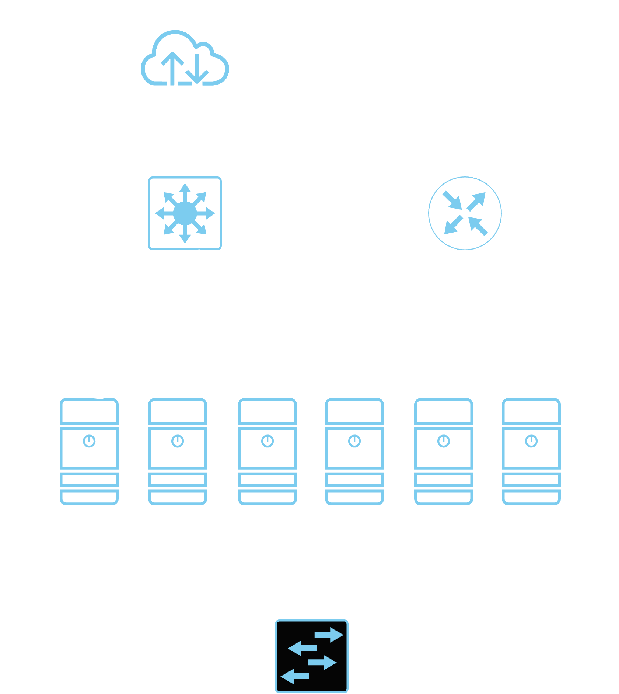

# Infra Labs 網路架構

## 前言

本文件旨在介紹 Infra Labs 目前使用的網路架構，說明各個網路設備的規格、用途，以及它們之間的連接方式。同時也會指出目前架構存在的問題和風險，為未來的改進提供參考。

本文主要面向網路工程師和系統管理員，假設讀者已經具備基本的網路知識和經驗。如果您在閱讀過程中有任何疑問或建議，歡迎隨時與[管理員](mailto:infra@cloudnative.tw)聯繫。

## 架構總覽

上圖展示了 Infra Labs 網路的整體架構。主要由以下幾個部分組成：

- 路由器：NFX250，負責 NAT、VPN 等功能
- 核心交換機：Arista DCS-7060CX-32S，負責內部網路和上游 BGP 
- 管理交換機：Juniper EX3300-48T，負責 Out-of-band 管理網路
- LTE 設備：提供備援網路連接

各設備之間的連接方式如圖所示。由於預算限制，目前的架構還存在一些單點故障的風險，詳情將在後文中說明。

## 網路設備

### 路由器

- 型號：NFX250
- 功能：
  - In-band management 網路的 NAT 網關
  - Dashboard 和 DNS 伺服器的 NAT
  - Out-of-band management 網路的 VPN 接入
  - DNS 伺服器的流量限制
  - 運行虛擬機 (VM)，用於：
    - 使用 Ansible 等管理工具部署各設備
    - 提供管理網路的 VPN 接入

### 交換機

#### 核心交換機

- 型號：Arista DCS-7060CX-32S
- 規格：32 port 100G 交換機
- 功能：
  - 與上游進行 BGP 互聯
  - 承載 Infra Labs 內部 OpenStack/Ceph 等服務的網路

#### 管理交換機 

- 型號：Juniper EX3300-48T
- 功能：
  - 提供 Out-of-band 管理網路
  - 連接主機的 IPMI 和網路設備的管理端口
  - 上行連接 NFX250 路由器

### LTE 設備

LTE 設備用於提供備援網路連接。當主要網路（Arista 或 NFX250）出現故障導致外部無法訪問時，可以通過 LTE 遠程接入管理網路進行搶修。

## 網段規劃

| VLAN | 網段 | 用途 |
|------|--------------|------------|
| 1 (untagged) | 192.168.0.0/24 | In-band management |
| 100 | 10.0.0.0/24 | VM internal |
| 101 | 10.0.1.0/24 | libvirt internal (for migration) |  
| 1113 | 192.168.113.0/24 | API network |
| 1114 | 192.168.114.0/24 | Ceph public network |
| 1115 | 192.168.115.0/24 | Ceph private network |
| 2116 | 103.122.116.0/23 | Public network |
| 1007 | 192.168.7.0/24 | Out-of-band management |

## 總結

綜上所述，Infra Labs 目前的網路架構基本滿足內部服務和管理的需求，但仍存在一些問題和風險：

1. 由於預算限制，核心設備缺乏冗餘，存在單點故障風險。一旦關鍵設備發生故障，可能導致整個網路不可用。

2. 缺乏對網路設備和鏈路的監控，故障定位和處理的效率有待提高。

未來我們計劃在預算允許的情況下，對網路架構進行以下優化：

1. 引入設備冗餘，消除單點故障。

2. 建設全面的監控系統，實現網路的可視化和自動化運維。

3. 儘量採用開源軟體，降低成本並提高可定制性。

我們歡迎網路設備廠商提供贊助或優惠，幫助我們更快實現架構升級。如果您有任何建議或意願提供支持，請聯繫[管理員](mailto:infra@cloudnative.tw)。
